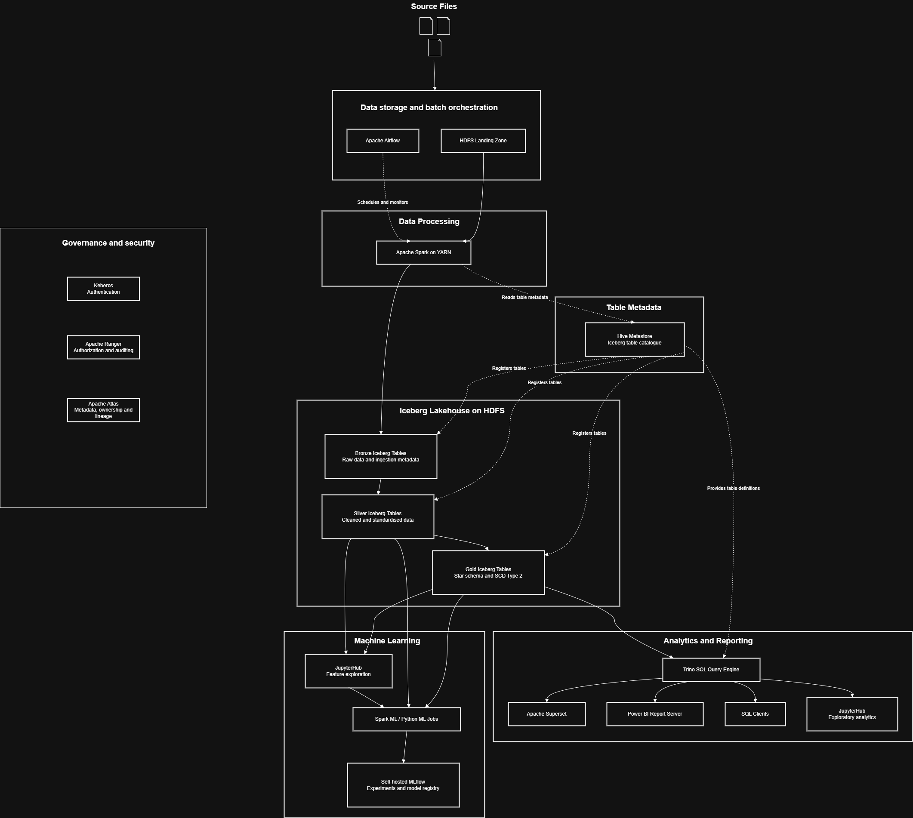
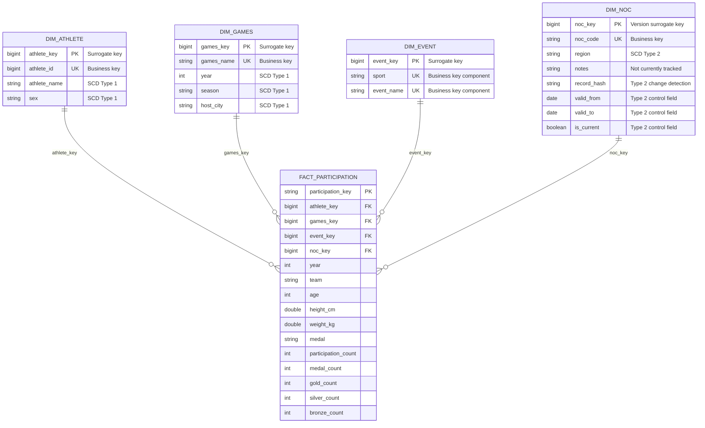

# Olympic Data Platform — Architecture and Star Schema
## Data Platform Architecture


### Architecture Justification

The proposed platform is fully self-hosted and does not depend on any SaaS service.<br>
Apache Airflow orchestrates batch pipelines, dependencies, retries, scheduling and operational monitoring.<br>
Apache Spark running on YARN provides scalable distributed processing for large Olympic datasets.<br>
HDFS stores source files and analytical data reliably across the cluster.<br>
Apache Iceberg manages Bronze, Silver and Gold datasets as transactional tables over Parquet files.<br>
Iceberg provides atomic commits, snapshots, schema evolution, partition evolution and time travel.<br>
The Hive Metastore acts as the technical catalogue for Iceberg table schemas and locations.<br>
The Bronze layer preserves source data and ingestion metadata for traceability and replay.<br>
The Silver layer cleans, standardises, deduplicates and validates data for downstream use.<br>
The Gold layer exposes a dimensional model optimised for analytics and reporting.<br>
Trino provides distributed SQL access to the Gold Iceberg tables.<br>
Analytics can be delivered through Apache Superset, Power BI Report Server, SQL clients or JupyterHub.<br>
JupyterHub also supports exploratory analysis, feature engineering and data-science development.<br>
Spark ML and Python deep-learning frameworks can train models from Silver and Gold datasets.<br>
A self-hosted MLflow server tracks experiments, model metrics, artefacts and model versions.<br>
Apache Atlas provides metadata governance, ownership information and end-to-end lineage.<br>
Apache Ranger controls data access and auditing, while Kerberos authenticates users and services.<br>
This architecture is scalable, governed, transactional and supports batch analytics, machine learning and deep learning.<br>
This architecture is scalable, governed, transactional and capable of supporting batch analytics, machine learning and deep learning.<br>
## Star Schema




### Fact-table grain

One row in `fact_participation` represents one athlete participating in one Olympic event, during one Games edition, representing one team and one National Olympic Committee.

The fact table contains foreign keys to the four dimensions and additive measures for participations and athlete medal records.

## Slowly Changing Dimension Strategy

Slowly Changing Dimension strategies define how changes to descriptive dimension attributes are handled over time.

Business keys and surrogate keys are not normally assigned an SCD type. Business keys identify dimension members, while surrogate keys provide internal identifiers used by the fact table.

### Business keys and surrogate keys

| Dimension     | Surrogate key | Business key             |
| ------------- | ------------- | ------------------------ |
| `dim_athlete` | `athlete_key` | `athlete_id`             |
| `dim_games`   | `games_key`   | `games_name`             |
| `dim_event`   | `event_key`   | `sport` and `event_name` |
| `dim_noc`     | `noc_key`     | `noc_code`               |


### SCD Type 1

SCD Type 1 replaces the current value with the latest source value and does not preserve the previous value.

The `dim_athlete`, `dim_games`, and `dim_event` dimensions use Type 1 behaviour for their descriptive attributes because they are rebuilt from the latest Silver data and written using overwrite mode.

| Dimension     | Type 1 fields                  | Behaviour                                                                                            |
| ------------- | ------------------------------ | ---------------------------------------------------------------------------------------------------- |
| `dim_athlete` | `athlete_name`, `sex`          | Corrections replace the existing values without retaining history.                                   |
| `dim_games`   | `year`, `season`, `host_city`  | The latest values replace the previous values.                                                       |
| `dim_event`   | No separate descriptive fields | `sport` and `event_name` form the business key rather than independently tracked descriptive fields. |

For example, when the same `athlete_id` is received with a corrected `athlete_name`, the new name replaces the previous name.

```text
Before:
athlete_id = 123
athlete_name = John Smith

After:
athlete_id = 123
athlete_name = Jonathan Smith
```

The previous value, `John Smith`, is not retained.

Although the dimension tables are physically overwritten, their business keys are still used to identify the dimension members. A changed business key is generally treated as a different entity rather than as a Type 1 field update.

### SCD Type 2

SCD Type 2 preserves historical changes by expiring the current dimension record and inserting a new version.

The project implements SCD Type 2 for the `region` field in `dim_noc`.

When the region associated with a `noc_code` changes:

* the existing record is closed;
* `valid_to` is updated;
* `is_current` is set to `false`;
* a new record is inserted;
* the new record receives a different `noc_key`;
* `valid_from` is set to the new batch date;
* `is_current` is set to `true`.

Example:

```text
noc_key | noc_code | region              | valid_from | valid_to   | is_current
101     | POR      | Portugal            | 2026-06-20 | 2026-06-20 | false
102     | POR      | Portuguese Republic | 2026-06-21 | 9999-12-31 | true
```

The two records have the same business key, `noc_code`, but different surrogate keys because they represent different historical versions.

The Type 2 technical fields are:

| Field         | Purpose                                          |
| ------------- | ------------------------------------------------ |
| `noc_key`     | Uniquely identifies each historical version.     |
| `valid_from`  | Indicates when the version became valid.         |
| `valid_to`    | Indicates when the version stopped being valid.  |
| `is_current`  | Identifies the active version.                   |
| `record_hash` | Detects changes to the tracked Type 2 attribute. |

### The `notes` field

The `notes` field is stored in `dim_noc`, but it is not included in the current change-detection hash.

Therefore, a change only to `notes` does not currently trigger a new Type 2 version or a Type 1 update.

In the current implementation, `notes` should be described as a stored attribute that is not independently tracked for changes.


### Summary

| Dimension     | Strategy                                                                       |
| ------------- | ------------------------------------------------------------------------------ |
| `dim_athlete` | SCD Type 1 for `athlete_name` and `sex`.                                       |
| `dim_games`   | SCD Type 1 for its descriptive attributes.                                     |
| `dim_event`   | Business-key-based dimension with no separately tracked historical attributes. |
| `dim_noc`     | SCD Type 2 for `region`; `notes` is not currently tracked independently.       |

The fact table does not use an SCD strategy because it records participation events rather than descriptive dimension attributes.
